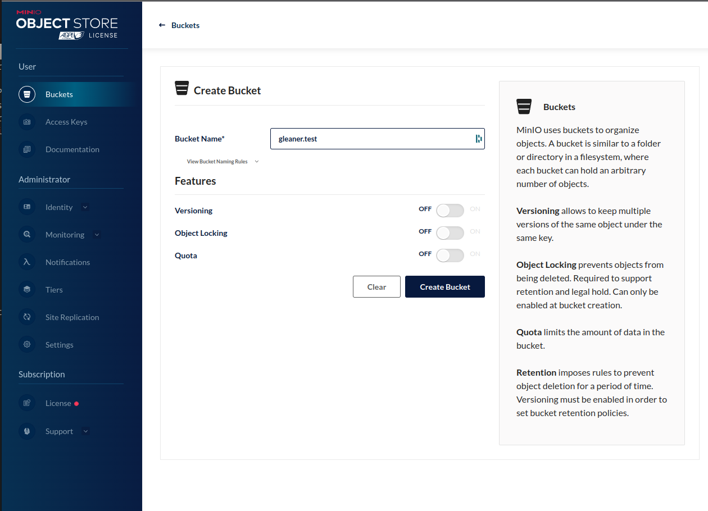
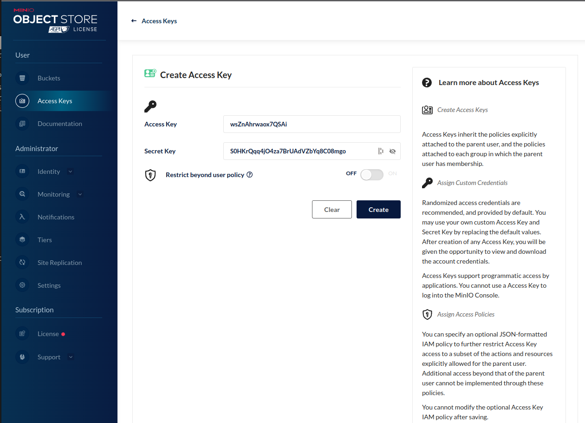

# Gleaner Quick Start

## About 

This document provides a quick approach to the setup and use of gleaner.


The basic flow of Gleaner begins with a data source sitemap.  That sitemap is 
read by Gleaner. Gleaner will leverage an object store, S3 compliant, and, if 
needed, a headless chrome instance.  

This headless chrome is only needed if the site 
inserts the JSON-LD into the HTML by means of Javascript.  If the JSON-LD is in the 
HTML itself via ```<script>```  tag, this is not needed.

Once Gleaner runs the JSON-LD is present in the object store.  From there it can 
loaded by scripts or other ETL programs, like Nabu, into a triplestore or other 
data systems.

## 1: Pre-requisites

Before running Gleaner there are a few requirements for backend architecture that 
are required.  

First is an AWS S3 compatible object store as a place to store and 
access the objects.  The other, is a means to render pages when needed.
This last point is only required if you are working with sources that place the JSON-LD 
into the page with Javascript.  

Finally, many of these systems are easiest to use when leveraging [OCI](https://opencontainers.org/) compliant 
container system like [Podman](https://podman.io/) or [Docker](https://www.docker.com/).
 

### Object Store

Gleaner uses any AWS S3 compatible object store.  These means you can use 
cloud based object stores like Amazon AWS S3, Google Cloud Storage.  Using 
commercial cloud is not required as there are open source and cross platform 
solutions.  Two of those will be discoursed here but there are others 
not discussed such as [Ceph](https://ceph.io/ceph-storage/object-storage/), 

Set up base config with

```
export MINIO_ADDRESS=192.168.202.114
export MINIO_PORT=49153
export MINIO_USE_SSL=false
export MINIO_ACCESS_KEY=bestkeyever
export MINIO_SECRET_KEY=bestsecretever
export MINIO_BUCKET=gleaner.test
```


### S3 ninja

For a fast setup for exploration or simple testing the [S3 ninja](https://s3ninja.net/) 
package is fast and simple to use.  From the documentation a quick start looks like:

* A readily packaged docker image is available at scireum/s3-ninja
* Run like ```docker run -p 9444:9000 scireum/s3-ninja:latest```
* Navigate to http://localhost:9444/ui
* Run S3 API-Calls against http://localhost:9444/ (e.g. http://localhost:9444/test-bucket/test-object)
* Provide an volume for /home/sirius/data to persist data accross restarts.
S3Ninja runs as user id 2000 inside the container. If you link a existing directory 
into your container, change the user/group id to 2000.

Note that in the above approach the data will not be persisted between instance of 
S3 ninja. So you may wish to add a local volume (directory) mount to the command.  

### Minio

A more production level approach would be to use [Minio](https://min.io/).  Minio is an 
open source S3 compliant object store.  It is a strong and robust approach.  Minio has
extensive documentation for use.  The OCI/Docker approach is provided by Minio at
[Quickstart for Containers](https://min.io/docs/minio/container/index.html)


```
mkdir -p ~/minio/data

podman run --privileged  --group-add keep-groups \
   -p 9000:9000 \
   -p 9090:9090 \
   -v ~/minio/data:/data \
   -e "MINIO_ROOT_USER=ROOTNAME" \
   -e "MINIO_ROOT_PASSWORD=CHANGEME123" \
   quay.io/minio/minio server /data --console-address ":9090"
   ```

Point your browser at:  http://localhost:9090/buckets 
and use the USER and PASSWORD you set above.

You should see something like:


Next you will need to create a bucket.



The next step is to create access keys for Gleaner to.  Select the _Access Keys_
menu item.  Use the create access key button to generate a set of keys.  


Note these down or download them.  The secret will not be shown again and you will
need it.



At this point Minio should be set up, running, have a bucket you can use and you have
the access values to use for Gleaner.  You will need these in the _Configuration_ section
below. 

### Headless Chrome

This pre-requisite is based on the fact that JSON-LD can be placed into HTML pages
either statically in the HTML or dynamically placed into the HTML by a javascript
that is run by the browser on load.  In this later case, it is required to run the 
javascript to update the HTML.   

To do this we use a "headless chrome" which can be thought of as the engine of Chrome
running without a user interfaces that simply generates the HTML as would be done 
by a user browser.  

There are many ways to address this so we will simply present one based on 
a OCI image that you can run with Docker or Podman, for example.  

This documentation will use the zenika/alpine-chrome which can also be found 
on GitHUb at [https://github.com/Zenika/alpine-chrome](https://github.com/Zenika/alpine-chrome).
The prebuilt container can also be found at Docker Hub at
[zenika/alpine-chrome](https://hub.docker.com/r/zenika/alpine-chrome).  


## 2: Starting with Gleaner
 
With the required architecture set up and ready we are ready to get started with 
Gleaner.

### Download

First we need to download the Gleaner release.  This can be found at
the URL [https://github.com/gleanerio/gleaner/releases](https://github.com/gleanerio/gleaner/releases).
For this documentation we will use the [v3.0.7_badsitemap](https://github.com/gleanerio/gleaner/releases/tag/v3.0.7_badsitemap).
You can download the release that matches your platform at this location.

We will be use the [https://github.com/gleanerio/gleaner/releases/download/v3.0.7_badsitemap/glcon-v3.0.7_badsitemap-linux-amd64.tar.gz](https://github.com/gleanerio/gleaner/releases/download/v3.0.7_badsitemap/glcon-v3.0.7_badsitemap-linux-amd64.tar.gz) 
download, but select that one that matches your OS and chip 
architecture.  

_Download_

```
❯ mkdir testrun
❯ cd testrun
❯ wget https://github.com/gleanerio/gleaner/releases/download/v3.0.7_badsitemap/gleaner-v3.0.7_badsitemap-linux-amd64.tar.gz
...
❯ ls
gleaner-v3.0.7_badsitemap-linux-amd64.tar.gz

```

_Extract_
```
❯ tar -zxf gleaner-v3.0.7_badsitemap-linux-amd64.tar.gz
❯ ls
configs  docs  gleaner  gleaner-v3.0.7_badsitemap-linux-amd64.tar.gz  README.md  schemaorg-current-https.jsonld  scriptsls

```

There are several coponents to this download.  These include 
scripts, docs, etc.  

For this quickstart we will make a ```rundir``` and copy the elements we
need into that directory.

```
❯ mkdir rundir
❯ cd rundir
❯ cp ../gleaner .
❯ cp ../schemaorg-current-https.jsonld .
❯ cp ../configs/template/gleaner_base.yaml .
```

At this point we ware ready to generate or edit our 
configuration files.  


### Configure

_Object store secrets_

There are many ways you can deal with the secret values used
to access the object store.  You can edit them directly into the 
main gleaner config if you wish.

Alternatively, Gleaner can read these values from environment 
variables.  This can be useful when running Gleaner in a container
environment but can also be used at the command line as in this 
documentation.

To use this approach, generate small scripts and set the 
environment variables according to your shells documentation.  This
will change and the example that follows is valid for bash or 
zsh style shells.  

```
export MINIO_ADDRESS=192.168.202.114
export MINIO_PORT=9000
export MINIO_USE_SSL=false
export MINIO_ACCESS_KEY=yourkeyhere
export MINIO_SECRET_KEY=yoursecrethere
export MINIO_BUCKET=gleaner.test
```

> Note:  be careful when naming buckets.  The structure must be compliant with 
> S3 bucket naming conventions.  

_Gleaner Config file_

```yaml
context:
  cache: true
  strict: true
contextmaps:
  - prefix: "https://schema.org/"
    file: "./schemaorg-current-https.jsonld"  # wget http://schema.org/docs/jsonldcontext.jsonld
  - prefix: "http://schema.org/"
    file: "./schemaorg-current-https.jsonld"  # wget http://schema.org/docs/jsonldcontext.jsonld
gleaner:
  mill: false
  runid: runX
  summon: true
summoner:
    after: ""
    delay:  # milliseconds (1000 = 1 second) to delay between calls (will FORCE threads to 1)
    headless: http://127.0.0.1:9222  # URL for headless see docs/headless
    mode: full
    threads: 5
millers:
  graph: true
minio:
  address:
  port:
  accessKey:
  secretKey:
  ssl:
  bucket:
sources:
  - sourcetype: sitemap
    name: iris
    logo: http://ds.iris.edu/static/img/layout/logos/iris_logo_shadow.png
    url: http://ds.iris.edu/files/sitemap.xml
    headless: false
    pid: https://www.re3data.org/repository/r3d100010268
    propername: IRIS
    domain: http://iris.edu
    active: true
    credentialsfile: ""
    other: {}
    headlesswait: 0
    delay: 0

```

### Run

The current set of flags follows:

```bash
EarthCube Gleaner
Usage of /tmp/go-build589932266/b001/exe/main:
  -cfg string
        Configuration file (can be YAML, JSON) Do NOT provide the extension in the command line. -cfg file not -cfg file.yml (default "config")
  -log string
        The log level to output (trace | debug | info | warn | error | fatal) (default "warn")
  -mode string
        Set the mode (full | diff) to index all or just diffs (default "full")
  -rude
        Ignore any robots.txt crawl delays or allow / disallow statements
  -setup
        Run Gleaner configuration check and exit
  -source string
        Override config file source(s) to specify an index target
```

With the above configurations set we should be able to run Gleaner with a
specified source.  Note the example only has one source so this is not needed.  However
when you have multiple source you can specify a source with the ```-source``` flag.

This can be useful when running via a scheduling system or cron and you want to index
certain targets on a given schedule.  

If you exclude this ```--source``` flag, all the source will be indexed in a run.  

So an example run would look like the following.  


```bash
❯ ./gleaner -cfg gleanerconfigLocalNAS.yaml --source iris

version:
EarthCube Gleaner
 100% |████████████████████████████████████████████████████████████████████████████████████████████████████████████████████████████████████████████████████████████████████████████████████████████████| (28/28, 5 it/s)
-------RUN STATS --------
Start 2022-11-21 08:32:49.183440428 -0600 CST m=+0.039051392
---iris----
   SitemapCount: 28
   SitemapHttpError: 0
   SitemapIssues: 0
   SitemapSummoned: 28
   SitemapStored: 28
Calling cleanUp on a successful run
On success, will, if flagged, copy the log file to object store and delete it
```

## 3: Working with results

If all has gone well, at this point you have downloaded the JSON-LD documents into Minio or 
some other object store.Next we will install a client that we can use to work with these objects.

Note, there is a web interface exposed on the port mapped in the Docker compose file.
In the case of these demo that is 9000.  You can access it at
http://localhost:9000/ with the credentials set in the environment variable file.  

However, to work with these objects it would be better to use a command line tool, like mc.
The Minio Client, can be installed
following their [Minio Client Quickstate Guide](https://docs.min.io/docs/minio-client-quickstart-guide.html).
Be sure to place it somewhere where it can be seen from the command line, ie, make sure it
is in your PATH variable. 

If you are on Linux this might look something like:

```
wget https://dl.min.io/client/mc/release/linux-amd64/mc
chmod +x mc
./mc --help
```

There is also a [Minio Client Docker image](https://hub.docker.com/r/minio/minio-client/) 
that you can use as well but it will be more difficult to use with the following scripts due
to container isolation. 

To man an entry in the mc config use:

```
mc alias set oih  http://localhost:9000 worldsbestaccesskey worldsbestsecretkey
```

We should now be able to list our object store.  We have set it up using the alias _oih_.

```
user@ubuntu:~/clidocker# mc ls oih
[2021-08-15 14:31:20 UTC]     0B gleaner/
user@ubuntu:~/clidocker# mc ls oih/gleaner
[2021-08-19 13:36:04 UTC]     0B milled/
[2021-08-19 13:36:04 UTC]     0B orgs/
[2021-08-19 13:36:04 UTC]     0B prov/
[2021-08-19 13:36:04 UTC]     0B results/
[2021-08-19 13:36:04 UTC]     0B summoned/
```

You can explore mc and see how to copy and work with the object store.  

## Loading to the triplestore

As part of our Docker compose file we also spun up a triplestore.  Let's use that now.  


Now Download the minio2blaze.sh script.

```bash
curl -O https://raw.githubusercontent.com/earthcubearchitecture-project418/gleaner/master/scripts/minio2blaze.sh
chmod 755 minio2blaze.sh 
```

The content we need to load into the triplestore needs to be in RDF for Blazegraph.  We also need
to tell the triplestore how we have encoded that RDF.   If look in the object store at

```
mc ls oih/gleaner/milled
[2021-08-19 13:26:52 UTC]     0B samplesearth/
```

We should see a bucket that is holding the RDF data converted from the JSON-LD.  Let's use this
in our test.   We can pass this path to the minio2blaze.sh script.  This script will go looking 
for the mc command we installed above, so be sure it is in a PATH location that script can see.  

```
./minio2blaze.sh oih/gleaner/milled/samplesearth
...   lots of results removed 
```

If all has gone well, we should have RDF in the triplestore.  We started our triplestore as part of
the docker-compose.yml file.  You can visit the triplestore at http://localhost:9999/blazegraph/#splash

Note, you may have to try other addresses other than _localhost_ if your networking is a bit different with
Docker.  For me, I had to use a real local IP address for my network, you might also try _0.0.0.0_.

Hopefully you will see something like the following.


We loaded into the default _kb_ namespace, so we should be good there.  We can see that is listed 
as the active namespace at the _Current Namespace: kb_ report.  

Let's try a simple SPARQL query.  Click on the _Query_ tab to get to the query user interfaced. We
can use something like:

```
select * 
where 
{ 
  ?s ?p ?o
}
LIMIT 10
```

A very simple SPARQL to give us the first 10 results from the triplestore.  If all has gone well, 
we should see something like:


You can explore more about SPARQL and the wide range of queries you can do with it
at the W3C [SPARQL 1.1 Query Language](https://www.w3.org/TR/sparql11-query/) reference. 

## Conclusion

We have attempted here to give a quick introduction to the use of Gleaner in a Docker 
environment.  This is a very simple example, but it should give you an idea of the approach
used.  This approach can then be combined with other approaches documented to establish a 
more production oriented implementation.  Most of this documentation will be located
at the [Gleaner.io GitHub repository](https://github.com/gleanerio) and [Gleaner](https://github.com/gleanerio/gleaner) repository.

> Note: The plan is to merge the Gleaner.io GitHub repository into the first. 
